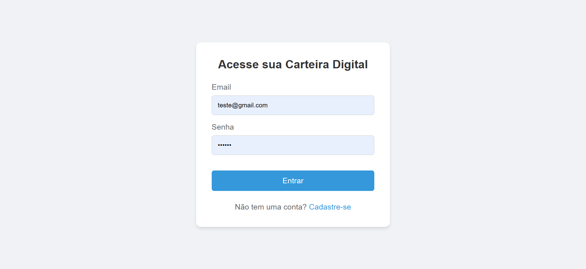
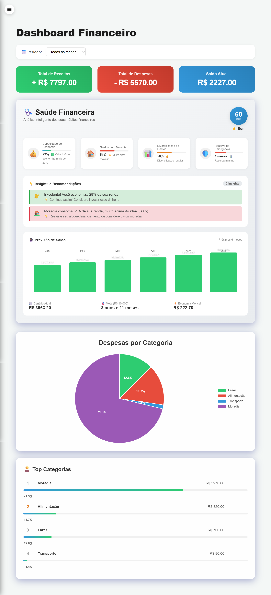
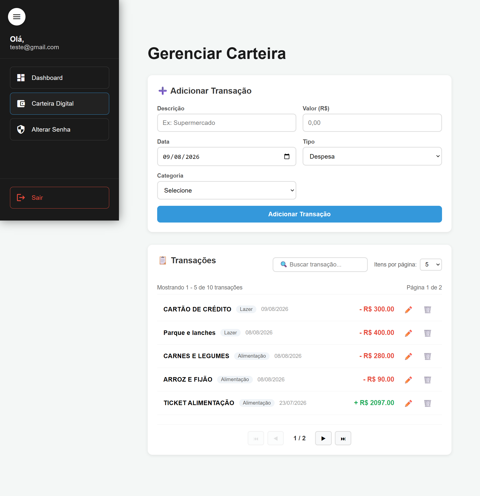
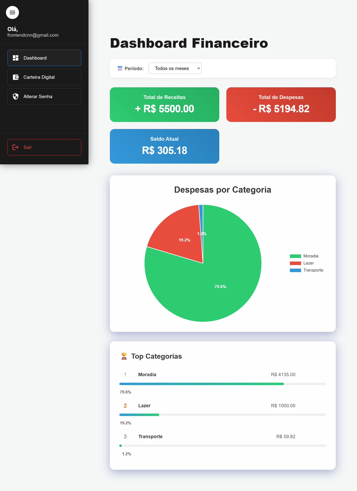
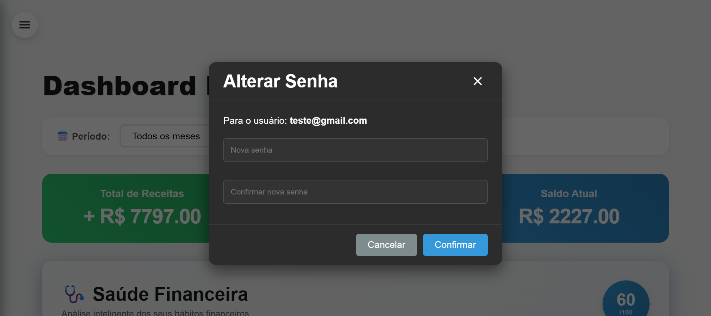

# Carteira Digital - Gerenciador Financeiro com Vue.js e Firebase

Este é um projeto de um aplicativo de carteira digital completo, desenvolvido com Vue.js 3, Vite, TypeScript e Firebase. Ele permite que os usuários gerenciem suas finanças pessoais, registrando receitas e despesas, visualizando um dashboard financeiro e muito mais.

## ✨ Funcionalidades

*   **Autenticação de Usuários:**
    *   Cadastro de novos usuários com e-mail e senha.
    *   Login seguro para acesso à carteira.
    *   Validação de formulários e tratamento de erros de autenticação.
*   **Dashboard Financeiro:**
    *   Visão geral do saldo atual, total de receitas e total de despesas.
    *   Gráfico de pizza interativo para visualizar a distribuição de despesas por categoria.
    *   Filtro de transações por mês.
*   **Gerenciamento de Transações:**
    *   Adição, edição e exclusão de transações (receitas e despesas).
    *   Formulário com campos para descrição, valor, data, tipo e categoria.
*   **Listagem de Transações com Recursos Avançados:**
    *   **Pesquisa:** Encontre transações rapidamente com a barra de pesquisa.
    *   **Paginação:** Navegue facilmente por um grande número de transações.
    *   **Ordenação:** Ordene as transações por data ou valor.
*   **Layout Responsivo e Moderno:**
    *   Interface de usuário limpa e intuitiva, construída com um design moderno.
    *   Barra lateral de navegação para um acesso rápido a todas as seções.
    *   Totalmente responsivo, adaptando-se a diferentes tamanhos de tela (desktop, tablet e mobile).

## 🖼️ Telas do Sistema

<p align="center">
  <strong>Tela de Login</strong><br>
  <em>Acesso seguro à sua carteira digital.</em><br>
  
</p>
<hr>
<p align="center">
  <strong>Dashboard Financeiro</strong><br>
  <em>Visão geral completa das suas finanças com gráficos interativos.</em><br>
  
</p>
<hr>
<p align="center">
  <strong>Carteira Digital</strong><br>
  <em>Gerencie suas receitas e despesas de forma simples e organizada.</em><br>
  
</p>
<hr>
<p align="center">
  <strong>Menu de Navegação</strong><br>
  <em>Acesso rápido a todas as funcionalidades do sistema.</em><br>
  
</p>
<hr>
<p align="center">
  <strong>Alteração de Senha</strong><br>
  <em>Mantenha sua conta segura alterando sua senha facilmente.</em><br>
  
</p>

## 🚀 Tecnologias Utilizadas

*   **Front-end:**
    *   [Vue.js 3](https://vuejs.org/) (com Composition API e `<script setup>`)
    *   [Vite](https://vitejs.dev/)
    *   [TypeScript](https://www.typescriptlang.org/)
    *   [Vue Router](https://router.vuejs.org/)
    *   [Chart.js](https://www.chartjs.org/) (com `vue-chartjs`)
*   **Back-end e Banco de Dados:**
    *   [Firebase](https://firebase.google.com/)
        *   **Authentication:** Para gerenciamento de usuários.
        *   **Firestore:** Como banco de dados NoSQL para armazenar as transações.
*   **Estilização:**
    *   CSS puro com escopo em componentes (`<style scoped>`).

## ⚙️ Como Executar o Projeto

1.  **Clone o repositório:**
    ```bash
    git clone https://github.com/seu-usuario/seu-repositorio.git
    cd seu-repositorio
    ```
2.  **Instale as dependências:**
    ```bash
    npm install
    ```
3.  **Configure o Firebase:**
    *   Crie um projeto no [console do Firebase](https://console.firebase.google.com/).
    *   Adicione um aplicativo da web ao seu projeto.
    *   Copie as credenciais do Firebase e cole-as no arquivo `src/firebase.ts`.
    *   Ative o **Authentication** com o provedor de e-mail/senha.
    *   Crie um banco de dados **Firestore**.
4.  **Execute o servidor de desenvolvimento:**
    ```bash
    npm run dev
    ```
5.  **Acesse o aplicativo em seu navegador:**
    *   Abra o endereço `http://localhost:5173` (ou a porta que o Vite indicar).

## 📁 Estrutura do Projeto

```
/
├── public/
├── src/
│   ├── assets/
│   ├── components/
│   │   ├── AppLayout.vue
│   │   ├── CarteiraDigital.vue
│   │   ├── Dashboard.vue
│   │   ├── Login.vue
│   │   ├── Register.vue
│   │   └── ...
│   ├── App.vue
│   ├── firebase.ts
│   ├── main.ts
│   └── router.ts
├── .gitignore
├── index.html
├── package.json
└── README.md
```

## 👨‍💻 Contribuição

Contribuições são sempre bem-vindas! Se você tiver alguma ideia para melhorar este projeto, sinta-se à vontade para abrir uma *issue* ou enviar um *pull request*.

## 📄 Licença

Este projeto está sob a licença MIT. Veja o arquivo [LICENSE](LICENSE) para mais detalhes.
